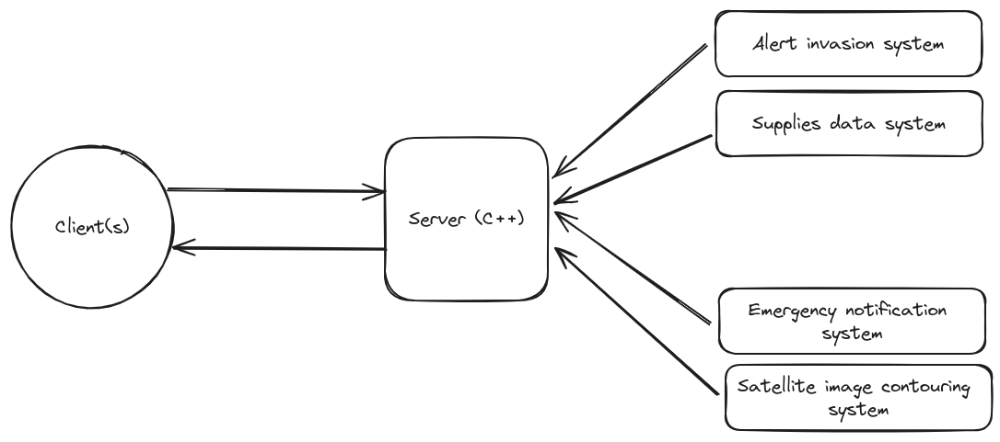
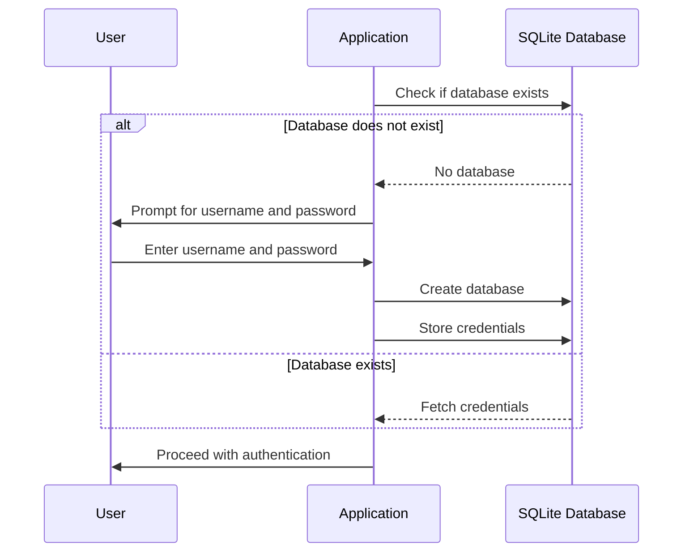

# H.P.CPP (Hope. Programming. CPP)

<details>
<summary> Problem to solve..</summary>


## 🎯 Objectives

The main objective of this laboratory is to train students in the efficient design and implementation of computer vision algorithms using High-Performance Computing (HPC) techniques. Participants are expected to acquire advanced knowledge of task parallelism, specifically through the use of OpenMP and C++ standard parallelism, and to be capable of properly profiling their applications. Furthermore, students are required to transform the tasks from the previous lab, "Development of Monitoring Application for Resistance", refactor the client-server model from C to C++, efficiently integrating HPC concepts to enhance performance.

## 📝 Evaluation Aspects

1. **Efficient Algorithm Design and Development:**
   - Design and implementation of algorithms that leverage High-Performance Computing capabilities, with a focus on task parallelism using OpenMP.

2. **Accurate Application Profiling:**
   - Precise profiling of developed applications, identifying and addressing potential bottlenecks to improve computational efficiency.

3. **Migration from Client-Server Model to C++:**
   - Successful transition from the C-based client-server model to C++, ensuring the proper integration of HPC concepts to enhance operational performance.

4. **Validation and Performance Testing:**
   - Performance testing to validate the effectiveness of HPC implementations, emphasizing significant improvements in execution speed.

5. **Technical Documentation and Critical Evaluation:**
   - Preparation of technical documentation that provides clear and detailed explanations of the decisions made during implementation, along with a critical evaluation of the impact of HPC techniques on the overall performance of applications.

This laboratory aims to equip students with advanced HPC skills, enabling them to address complex computational problems efficiently and apply these techniques in practical and relevant contexts.

## 📽 🎞 There is hope...

*In the remnants of a once-majestic civilization, humanity grapples with the shadow cast by an unyielding fungal infection. Joel, a leader etched with the scars of both loss and survival, finds himself standing at the pivotal junction of guiding the resistance within an underground sanctuary. Formerly a thriving industrial hub, this refuge now stands as the ultimate stronghold against the metamorphosis of the populace into hostile entities. The control room, transformed into a crucible of uncertainty, serves as the focal point for Joel's vision: a real-time monitoring application, the final beacon of hope for the resistance.*

*Thanks to the successful development of the real-time monitoring application, the resistance's last hope has come to life. The shelter's once dimly lit corridors now buzz with a renewed sense of purpose and determination. Joel's vision of a real-time monitoring system has become a reality, and it's changing the dynamics within the underground sanctuary.*

*The application has transformed the way survivors perceive their world. No longer shrouded in darkness and uncertainty, the refuge's inhabitants now have access to critical information at their fingertips. They receive real-time updates on the status of the shelter, the latest weather conditions, supply availability, and emergency alerts—all neatly presented in a user-friendly interface.*

*Formerly a thriving industrial hub, the refuge has evolved into the ultimate stronghold against the metamorphosis of the populace into hostile entities. The once-abandoned control room, now the nerve center of the monitoring system, pulsates with activity as dedicated survivors work tirelessly to maintain and improve the application's functionality.*

<p align="center">
  
</p>

*Survivors now have a lifeline, a tool that empowers them to make informed decisions, coordinate resources, and respond swiftly to threats. The real-time monitoring application has instilled a newfound sense of unity and purpose among the inhabitants. They face an uncertain future with greater preparation, knowing that they have the technological advantage needed to survive and ultimately reclaim what was lost to the fungal infection. With their real-time monitoring application guiding their path, avoiding spore hotspots and navigating through the labyrinth of the fallen cities, they embark on their most crucial mission yet: to bring back hope, to heal the land, and to forge a future from the ruins of the past*

## 🔑 Application Description

<p align="center">
  
</p>

The application, designed as a real-time monitoring and command system for post-apocalyptic refuge management, integrates several advanced technologies to enhance its functionality:
- **Parallelism in Canny Edge Detection**: Utilizes OpenMP to accelerate the convolution operations inherent in Canny Edge Detection, crucial for analyzing images for security and surveillance purposes.
- **Allow to users to download the filter map**: Use the socket wrapper to send a zip file with the filtered image. Allow to users to sent and image and process it.
- **Data Management with [RocksDB](https://rocksdb.org/)**: The server utilizes RocksDB for storing critical data such as supplies and alerts, ensuring fast access and persistence.
- **REST Handling with [cpp-httplib](https://github.com/yhirose/cpp-httplib) on the Server**: The server leverages cpp-httplib to handle incoming REST requests, providing a lightweight and efficient means to manage HTTP communications.

<details>
 <summary><code>GET</code> <code><b>/supplies</b></code> <code>(retrive the current supplies in the database)</code></summary>

##### Parameters

> | name      |  type     | data type               | description                                                           |
> |-----------|-----------|-------------------------|-----------------------------------------------------------------------|
> | None      |  required | object (JSON or YAML)   | N/A  |


##### Responses

> | http code     | content-type                      | response                                                            |
> |---------------|-----------------------------------|---------------------------------------------------------------------|
> | `500`         | `application/json`                | `{"code":"500","message":"Bad Server"}`                            |
> | `200`         | `application/json`         | `{ "last_update": "12:27:29", "food": { "meat": 100, "vegetables": 200, "fruits": 150, "water": 1000 }, "medicine": { "antibiotics": 50, "analgesics": 100, "bandages": 100 }  `                                                                |

##### Example cURL

> ```javascript
>  http GET http://localhost:8889/supplies
> ```

</details>

<details>
 <summary><code>GET</code> <code><b>/alerts</b></code> <code>(retrive the current alerts in the database)</code></summary>

##### Parameters

> | name      |  type     | data type               | description                                                           |
> |-----------|-----------|-------------------------|-----------------------------------------------------------------------|
> | None      |  required | object (JSON or YAML)   | N/A  |


##### Responses

> | http code     | content-type                      | response                                                            |
> |---------------|-----------------------------------|---------------------------------------------------------------------|
> | `500`         | `application/json`                | `{"code":"500","message":"Bad Server"}`                            |
> | `200`         | `application/json`         | `{ "last_update": "12:27:29", "nort": { "healty": 100, "sick": 0 }, "east": { "healty": 100, "sick": 0 }, "west": { "healty": 100, "sick": 0 }, "south: { "healty": 100, "sick": 1 }  `                                                                |

##### Example cURL

> ```javascript
>  http GET http://localhost:8889/alerts
> ```

</details>

## 📌 Tasks to Implement

1. **Implement Parallelism for Canny Edge Detection**:
   - Apply OpenMP in the convolution processes of the Canny Edge Detection algorithm to enhance image processing speed.
2. **Integrate RocksDB for Data Management**:
   - Configure the server to use RocksDB for maintaining an updated and persistent store of supplies data and alerts.
3. **Set Up cpp-httplib on the Server**:
   - Implement cpp-httplib for managing REST requests, facilitating the receipt and response of HTTP requests efficiently.
4. **Use sockets for Data Retrieval**:
   - Use socket to upload and download files with and without the canny edge filter.
5. **Logging and Monitoring**:
   - Implement detailed logging of server activities and client interactions to monitor the system's performance and troubleshoot issues.

### 〽️ Bonus
 
 - When the client application is run for the first time, it should check for the presence of a local SQLite3 database. If the database does not exist, the application must create it and prompt the user to enter a username and password. These credentials should then be stored in the database for future use. On subsequent launches, the application should automatically retrieve and use the credentials from the database to authenticate the user.



 - Use [libbcrypt](https://github.com/rg3/libbcrypt/tree/master) to encrypt the password.

<details><summary>Code snip</summary>

```text
# Use this in the CMakeLists.txt
find_package(SQLite3 REQUIRED)

# Don't forget link the library!
```

```c
#include <stdio.h>
#include <sqlite3.h>

#define DB_NAME "user.db"

int callback(void *NotUsed, int argc, char **argv, char **azColName){
    int i;
    for(i = 0; i<argc; i++){
        printf("%s = %s\n", azColName[i], argv[i] ? argv[i] : "NULL");
    }
    printf("\n");
    return 0;
}

int main(int argc, char *argv[]) {

    sqlite3 *user_db;
    char *zErrMsg = 0;
    int result;

    // Try to open the database file
    result = sqlite3_open(DB_NAME, &user_db);
    if (result) {
        fprintf(stderr, "Can't open database: %s\n", sqlite3_errmsg(user_db));
        return 0;
    } else {
        fprintf(stdout, "Opened database successfully\n");
    }

    int table_exists = 0;

    // Check if table exists
    const char *sql_check = "SELECT name FROM sqlite_master WHERE type='table' AND name='USER';";

    result = sqlite3_exec(user_db, sql_check, [](void *data, int argc, char **argv, char **azColName) -> int {
        *(int*)data = 1;  // Set tableExists to 1 if the callback is called
        return 0;
    }, &table_exists, &zErrMsg);

    if (result != SQLITE_OK) {
        fprintf(stderr, "SQL error: %s\n", zErrMsg);
        sqlite3_free(zErrMsg);
    }

    // If table does not exist, create it
    if (!tableExists) {
        const char *sql_create = "CREATE TABLE USER("
                                 "username TEXT NOT NULL,"
                                 "password TEXT NOT NULL);";
        result = sqlite3_exec(user_db, sql_create, callback, 0, &zErrMsg);
        if (result != SQLITE_OK) {
            fprintf(stderr, "SQL error: %s\n", zErrMsg);
            sqlite3_free(zErrMsg);
        } else {
            fprintf(stdout, "Table created successfully\n");
        }
    } else {
        // Table exists, fetch records
        const char *sql_select = "SELECT username, password FROM USER;";
        result = sqlite3_exec(user_db, sql_select, callback, 0, &zErrMsg);
        if (result != SQLITE_OK) {
            fprintf(stderr, "SQL error: %s\n", zErrMsg);
            sqlite3_free(zErrMsg);
        } else {
            fprintf(stdout, "Operation done successfully\n");
        }
    }

    sqlite3_close(user_db);


    return 0;
}
```
</details>

- **RESTful API with [Ulfius](https://github.com/babelouest/ulfius)**: Clients are implemented using the Ulfius framework to make RESTful requests, enabling efficient communication with the central server.

</details>


<details>
<summary>Milestione 2 Description</summary>

For server-modules interactions I kept the IPC mechanisms used in the previos lab, with changes to addapt to cpp.

Now when the server gets a client request to update supplies, if the update is successful the data will be writen to Rocksdb. This way later historic data can be accessed. Same with infection alerts and power outage notifications, all these are stored as events in rocks db.

In the server there is a new child process to handle requests from the API REST

Each entry en rocksdb has a special formatr for it's key:

supplies_<id>_<timestamp>; <value>
alert_<id>_<timestamp>; <value>
notification_<id>_<timestamp>; <value>
The REST API supports request to this endpoints:

/alerts: all alerts recieved in json format

It can be passed as argument to the request for a specific json format alert. Id "latest" returns the latests supplies update
curl -G http://localhost:8015/alerts --data-urlencode 'id=0'
curl -G http://localhost:8015/supplies --data-urlencode 'id=latest'
/supplies : all supplies updates in json format

Id can be passed as argument to the request for a specific json format supplies status
curl -G http://localhost:8015/supplies --data-urlencode 'id=0'
curl -G http://localhost:8015/alerts --data-urlencode 'id=latest'
Only TCP clients can requesAt images to the server

Now when we run the server, the existence of 3 directories is checked, creating them if they dont exists. This directories are

/img/inputImg: available image for clients to trigger convertion.
/img/outputImg: here all the images of the diferent stages of canny are stored. They will be overwritten with each new processed image.
/img/zipFiles: here are stored .zip with compressed images.
When a client requests a image, a list all of all available images the server has will be given. The client can choose what image wants the server to send to him.

When a client requests to convert a certain image, the server will first see if the corresponding zip for that image already exists, in wich case it will not trigger a new canny convertion, avoiding proceessing a image that is been processed previously.

Downside of the previous bullet is that zip files will accumulate in the zipFiles folder, so ideally (i'll do it if i have time) there should be a mechanism to avoid this. For example:

Each time a new .zip is generated, remove the less recently used.
When there is X amont of files, remove 50 random files, or 50 less recenlty used.
For file compression into .zip I'm using zlib.

One problem of my current implmentation is that when a client is receiving a ZIP file it cant receive other messages from the server like alerts of shout down signals.
</details>


<details>
<summary>Application profiling</summary>


### Canny Edge Filter Profiling

#### Here I explain were I decided to use parallelism.

* **applyGaussianBlur()**

    * **Creation of the temporary image with edges**: the 5 sets of 2 nested for loops involved here do not seem to me to be good places to parallelise the program as although it would be possible (because there are no dependencies between the individual pixel assignments), I think the overhead introduced by the creation and management of multiple threads may outweigh the benefit of parallelising these low computational complexity operations.
    * **Kernel creation**: this operation must be sequential as each kernel element depends on the computation of the previous ones.
    * **Filter application**: Here we have a triple loop that iterates over each pixel of the temporary image and performs an operation with the kernel, this operation is highly parallelisable for the two outer loops, as each pixel can be processed independently. The inner loops cannot be parallelised as they are cumulative sum loops, so there is dependency on previous data. In addition, the inner loops are quite short, so there is no justification for introducing the additional synchronisation overhead that parallelising them would require. 


* **sobelOperator()**
* The main loop iterates over each pixel in the image and calculates the gradients in the X and Y directions using Sobel kernels. This part of the code is highly parallelisable, as each pixel is processed independently and the gradient calculations are simple operations and have no inter-pixel dependencies.

* **nonMaximumSuppression()**
    * Here the function iterates over each pixel of the gradient magnitude image (m_magnitude) to perform non-maximum suppression. Each pixel is processed independently, suggesting that there is potential for parallelism in this loop.
    
* **checkContours()**
    * The function uses recursion to follow weak contours in the edge image. Each recursive call processes one pixel and then calls itself to process neighbouring pixels.  Recursion makes parallelisation difficult and I would avoid applying it here. However, we can try refactoring the function to make it iterative and see if parallelising after that change generates any improvement.

* **applyLinkingAndHysteresis()**
In this function we can parallelise the identification of strong and weak edges. We have a loop that goes through each pixel of the image and assigns the pixels to the strongEdges and weakEdges arrays according to the threshold criteria. This loop can be parallelised, as each iteration is independent and there are no dependencies between pixels.

- **Function `applyGaussianBlur`:**
   - I parallelized the main loop where the Gaussian blur convolution filter is applied.

- **Function `sobelOperator`:**
   - I parallelized the main loop where gradients are calculated using Sobel kernels.

- **Function `nonMaximumSuppression`:**
   - I didn't directly apply parallelism in this function due to its recursive structure. However, I identified the loop for exploring neighbors as a potential candidate for parallelization after refactoring.

- **Function `applyLinkingAndHysteresis`:**
   - I parallelized the first loop where strong and weak edges are identified based on the specified thresholds.


### Time analysis:

Test Image: Satellite2.tif (the one of bigger size- 361,7 MB ) 

* Intel I7 7700K - 32GB RAM - 4 cores and 8 threads: 

| Execution | Without Optimization | With Optimization -O3 |
|-----------|----------------------|-----------------------|
| 1         | 38.0491 s            | 25.6778 s             |
| 2         | 37.8012 s            | 25.9013 s             |
| 3         | 38.2123 s            | 25.5695 s             |
| 4         | 38.0156 s            | 25.7882 s             |
| 5         | 38.1024 s            | 25.6221 s             |
| 6         | 37.9337 s            | 25.7098 s             |
| 7         | 38.1568 s            | 25.6463 s             |
| 8         | 37.8975 s            | 25.8204 s             |
| 9         | 38.0832 s            | 25.7446 s             |
| 10        | 37.9754 s            | 25.6759 s             |
| **Average** | **38.0272 s**       | **25.7269 s**          |

Shortest time with optimization: 25.5695 s  
Shortest time without optimization: 37.8012 s

</details>


